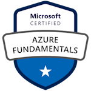

## Serhii Speshylov, _C# / Azure developer_

### Contacts

- LinkedIn: [linkedin.com/in/krb3d](https:\linkedin.com/in/krb3d)
- GitHub: [github.com/krb3d](https://github.com/krb3d)
- Email: [serhii.in.de@gmail.com](mailto:serhii.in.de@gmail.com)

### Profile summary

I'm an experienced **Software&nbsp;Engineer** with a **strong&nbsp;background** in **Backend&nbsp;technologies**, including **C#/.NET**, Microsoft **Azure&nbsp;Cloud**, and SQL/NoSQL **Databases**. Backed by over **9+&nbsp;years** in the **IT&nbsp;and&nbsp;services&nbsp;industry**. My academic&nbsp;focus was on Mechatronics, Robotics, and Automation Engineering.

I specialize in **developing backend&nbsp;applications** (including **design**&nbsp;and&nbsp;**deployment** phases sometimes), with a core emphasis on **integrating&nbsp;software** to solve **critical&nbsp;business&nbsp;challenges**. I believe **well&#8209;designed backend&nbsp;systems** are the foundation _of&nbsp;successful digital ventures_.

Beyond work, I'm passionate about **staying&nbsp;current** with **technology&nbsp;trends** and **sharing&nbsp;knowledge** with fellow enthusiasts.

Let's connect for exciting tech discussions or potential collaborations.

### Education

Sevastopol&nbsp;National&nbsp;Technical&nbsp;University, 2007, Sevastopol, Ukraine

- Specialist&nbsp;degree&nbsp;(5&nbsp;years), Automated Application Systems department

### My main skills and tech stack

- C#/.NET&nbsp;Core
- Cloud&nbsp;Design&nbsp;Patterns
- ASP.NET&nbsp;Core Applications
- Azure&nbsp;stack, _IaaS and PaaS_:
  - Azure Functions
  - Service Bus
  - CosmosBD (NoSQL)
  - Event Grid
  - Azure Storage
- Disributed Systems
- SQL: Entity Framework Core, Dapper
- Messaging systems, data processing flows
- Standalone workers
- Dockerized applications, Microservices
- Base DevOps practicies, CI/CD, GitHub Acions / Azure DevOps
- Basic Javascript, willingness to go deeper (TypeScript / frameworks)

### Languages

- English - professional working proficiency
- Ukrainian - native speaker
- German - elementary proficiency

### Professional experience

#### Senior Backend / Azure Developer

##### Berlin Brands Group (Multibrand ecommerce), [berlin-brands-group.com](https://www.berlin-brands-group.com/en)

> Jun. 2021 - Nov. 2023, Germany

- Adjust services Performance and Design for High Load events like Black Friday,
- Design and Implement multiple internal services and APIs, cloud-based and on-premise deployed,
  - Document Distribution Service - API on top of Azure Storage and CosmosDB with flexible documents upload and query capabilities,
  - Lookup Service - support service for domain models conversion libraries,
  - APIs and services for processing and transfer Orders from external markets to internal systems,
  - ERP data exchange API facades and converters,
- Prepare DevOps Pipelines and Azure ARM Templates for build and deployments,
- Interviews, Onboard for newcomers, Knowledge sharing

---

#### .NET / Azure Developer

##### Softpositive (IT Services and consulting), [softpositive.com](https://www.softpositive.com/)

> May 2019 - Jun. 2021,  Germany client, remote from Ukraine

- Cloud-based ESB pattern design and implementation,
- Step-by-step logging design and injection to existing APIs,
- Prepare Azure pipelines for build and deployments,
- Box packing helper API with Vue.js UI - parcel packing service for warehouse workers

---

#### .NET / Full-stack Developer

##### Dynamica Labs LLP (MS Dynamics CRM integrator), [dynamicalabs.com](https://www.dynamicalabs.com/)

> Sep. 2018 - May 2019, United Kingdom, remote from Ukraine

- Plugins adaptation for business requirements,
- Custom Windows services and console utilities for data management,
- Web pages for custom CRUD operations and reports,
- Working with Vue.js, Rewriting part of existing functionality to Promises/Async way,
- T-SQL: data updates and analyze

---

#### ERP Developer for HQ Sales Department

##### Roshen (Confectionery corporation), [roshen.com](https://www.roshen.com/en/about-roshen)

> Jan. 2018 - Sep. 2018, Ukraine

- Revision for b2b exchange data flow, implementation of new cache layer based on hashes,  up to _100x processing time speed up_,
- Rework of internal geodata visualization tool based on Google Maps
  - Transfer logic layer from dedicated server service into client-side, javascript,
- Adjustment of the proprietary reporting subsystem to the requirements of business: new data dimensions, overall speed up and new flexible data load tool.

---

#### Lead ERP Developer

##### Roivix.com (business and IT consulting), [roivix.com](http://www.roivix.com/ukr/)

> Nov.2016 - Aug. 2017, Ukraine

Design and implementation of business modules for ERP/Accountant systems for clients like _McDonalds Ukraine_ and _Pepsico Ukraine_

---

#### Lead Developer for Point-of-Sale System

##### Eroglu holding (clothes retail, Colins™ jeans), [colinsjeans.com](http://colinsjeans.com/)

> Sep. 2011 - Aug. 2016, Ukraine / Turkey

- Requirements gathering, System Design, and Implementation of Point-Of-Sale system,
- Integration of retail hardware to POS: ticket printers, barcode scanners, price checkers,
- Development of replication system via Web services: from store sales to office reports with a short delay,
- Design and implementations of “Reports via email” subsystem: auto-repair and send sales reports given by email body query,
- Design and implementation of flexible system for calculation of discounts/marketing actions,
- Integration with MS Dynamics AX via dedicated C# service,
- Integration with 3rd party systems: accounting, CRM, visitors counting devices
- Development team management, system growth planning,

---

#### ERP Developer, Lead of Deployment team

##### 1C-Rarus (business automation and consulting), 1c-rarus.com

> Sep. 2007 - Aug. 2011

- Development of business automation software on 1C:Enterprise framework,
- Adaptation and deployment software in outsource basis, staff training
- Performance testing, recommendations for improvements
- Business process analysis, requirements gathering, task management

### Courses, Projects and Certifiates

|                                                             |                                                              |
|:------------------------------------------------------------|:------------------------------------------------------------:|
| Microsoft Certified: AZ-900 Azure Fundamentals              |   |
| The Creative Javascript Course                              | [Code&nbsp;Repository](https://github.com/krb3d/developedbyed-js-basics)     |
| The Creative HTML5 & CSS3 Course                            | [Code&nbsp;Repository](https://github.com/krb3d/developedbyed-html-basics)   |
| Unity3d, Basic Kitchen Arcade Game, course by CodeMonkey    | [Code&nbsp;Repository](https://github.com/null-null-eins-zwei/KitchenChaos), [Play&nbsp;Game](https://krb3d.itch.io/kitchenchaos-learn)  |
